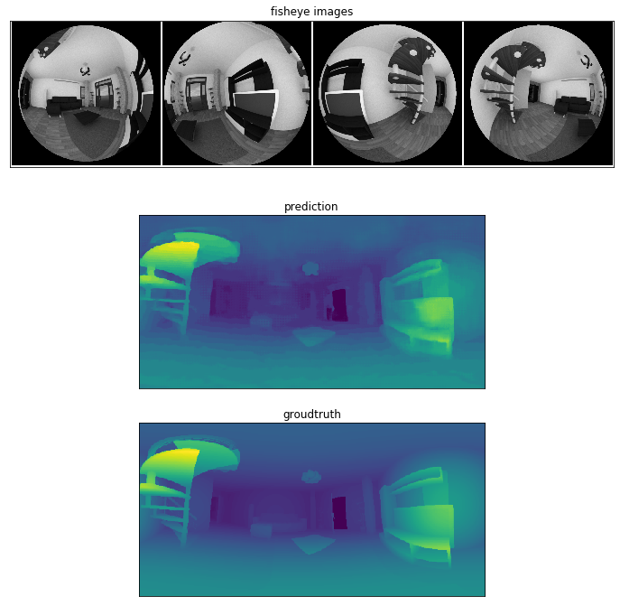
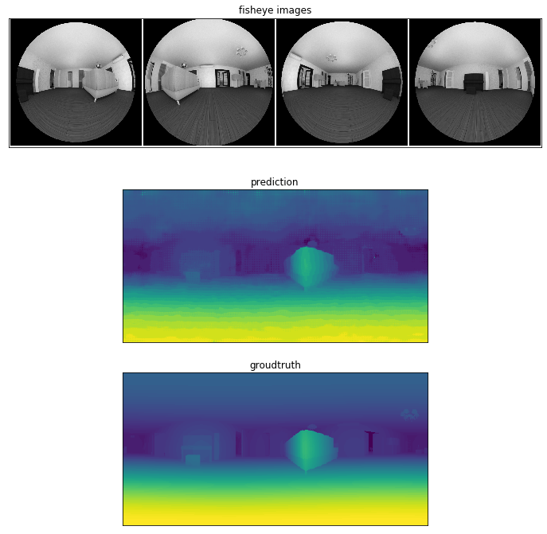
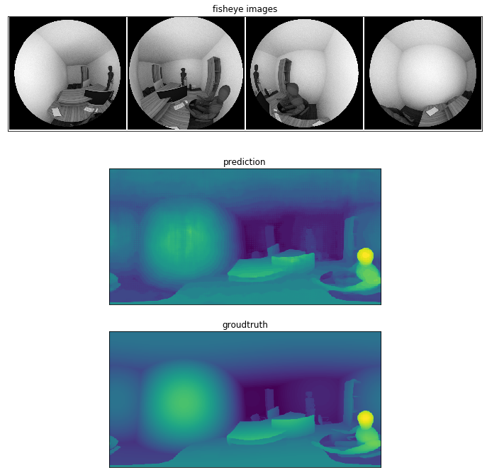

## OmniMVS PyTorch
An unofficial PyTorch implementation of ICCV 2019 paper 
["OmniMVS: End-to-End Learning for Omnidirectional Stereo Matching"](http://openaccess.thecvf.com/content_ICCV_2019/papers/Won_OmniMVS_End-to-End_Learning_for_Omnidirectional_Stereo_Matching_ICCV_2019_paper.pdf).


## Requirements
You need Python 3.6 or later for f-Strings.

Python libraries:
- PyTorch >= 1.3.1
- torchvision
- SciPy >= 1.4.0 (scipy.spatial.transform)
- OpenCV
- tensorboard
- tqdm
- Open3D >= 0.8 (only for visualization)

## Setup
### Clone repository
Please run the following command. 
On the first line, [Python OcamCalib undistortion library](https://github.com/matsuren/ocamcalib_undistort) is 
installed for undistortion of [Davide Scaramuzza's OcamCalib camera model](https://sites.google.com/site/scarabotix/ocamcalib-toolbox).
```bash
pip install git+git://github.com/matsuren/ocamcalib_undistort.git
git clone https://github.com/matsuren/omnimvs_pytorch.git
```

### Download dataset
Download OmniThings in Omnidirectional Stereo Dataset from [here](http://cvlab.hanyang.ac.kr/project/omnistereo/). 
After extraction, please put the dataset folder in the following places.

    omnimvs_pytorch/
    ├── ...
    └── datasets/
       └── omnithings/
            ├── cam1/
            ├── cam2/
            ├── cam3/
            ├── cam4/
            ├── depth_train_640/
            ├── ocam1.txt
            ├── ...

## Training
Run with default parameter (input image size: 500x480, output depth size: 512x256, disparity: 64). 
```bash
python train.py ./datasets/omnithings
```
These default parameters are smaller than the ones reported in their paper due to GPU memory limitation.
You can change parameters by arguments (`-h` option for details). 

## Results
Predictions on OmniHouse after training on OmniThings (ndips=48).

 

 

 


